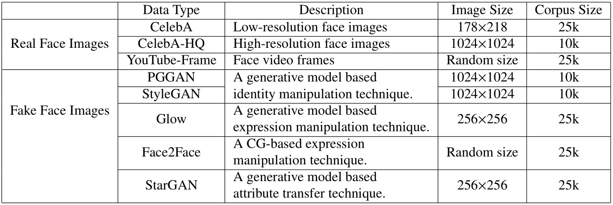

# Hybrid Fake Face Dataset 
We build a hybrid fake face (HFF) dataset, which contains eight types of face images. For real face images, three types of face images are randomly selected from three open datasets. They are low-resolution face images from CelebA, high-resolution face images from CelebA-HQ, and face video frames from FaceForensics, respectively. Thus, real face images under internet scenarios are simulated as real as possible. Then, some most representative face manipulation techniques, which include PGGAN and StyleGAN for identity manipulation, Face2Face and Glow for face expression manipulation, and StarGAN for face attribute transfer, are selected to produce fake face images. The HFF dataset is a large fake face dataset, which contains more than 155k face images. As shown below, we summarizes the details of the HFF dataset.



Please consult our [paper](https://arxiv.org/abs/2005.04945) for more information.

## HFF dataset terms
Please agree to the following terms of use before we provide you with access to HFF dataset.
* Researchers can only use HFF dataset for non-commercial research and educational purposes.
* Researchers take full responsibility for their use of the dataset, and protect the dataset providers from any and all claims arising from the use of the dataset by researchers.
* Researchers can provide others with access to the dataset if they agree to accept the terms of use.
* We reserve the right to terminate researchers' access to the dataset at any time.

## Download
If you agree to the above 'HFF dataset terms' and would like to download HFF dataset, please answer the following questions and send them to us at [guozhiqing@hnu.edu.cn](mailto:guozhiqing@hnu.edu.cn).
* Name
* Affiliation
* Principal Investigator/Advisor's Name and Email
* Research purpose

## Citation
Please cite our paper if HFF dataset is used in your research:
```
@article{article,
author = {Guo, Zhiqing and Yang, Gaobo and Chen, Jiyou and Sun, Xingming},
year = {2020},
month = {5},
pages = {1-14},
title = {Fake face detection via adaptive manipulation traces extraction network},
journal = {arXiv}
}
```
